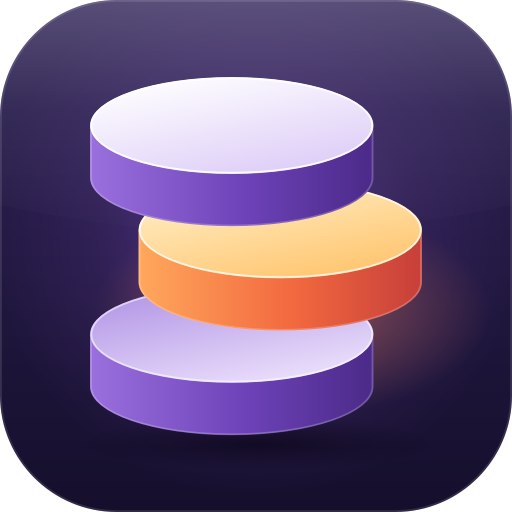
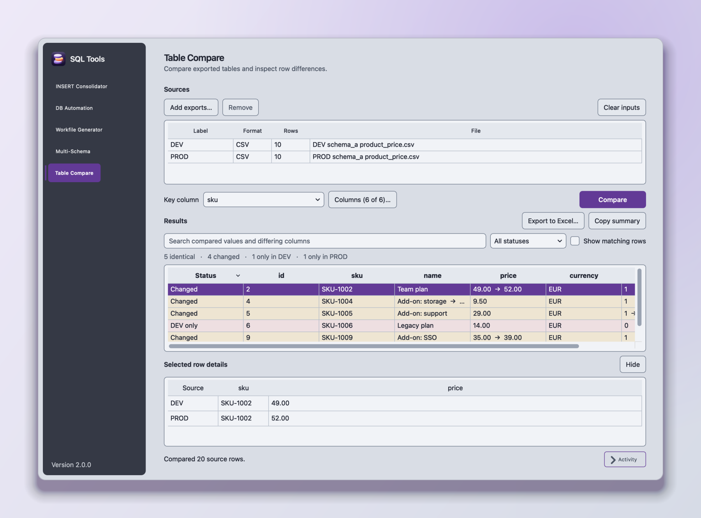
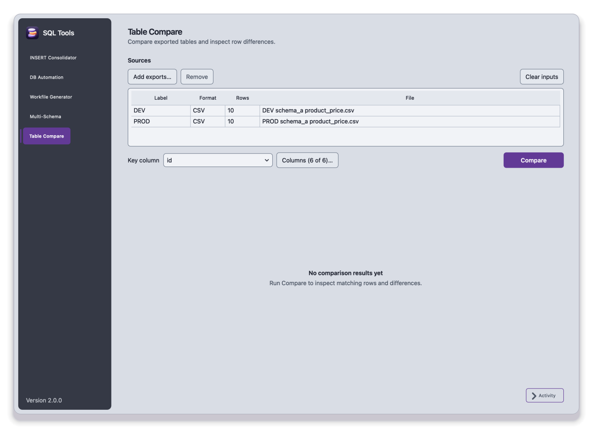
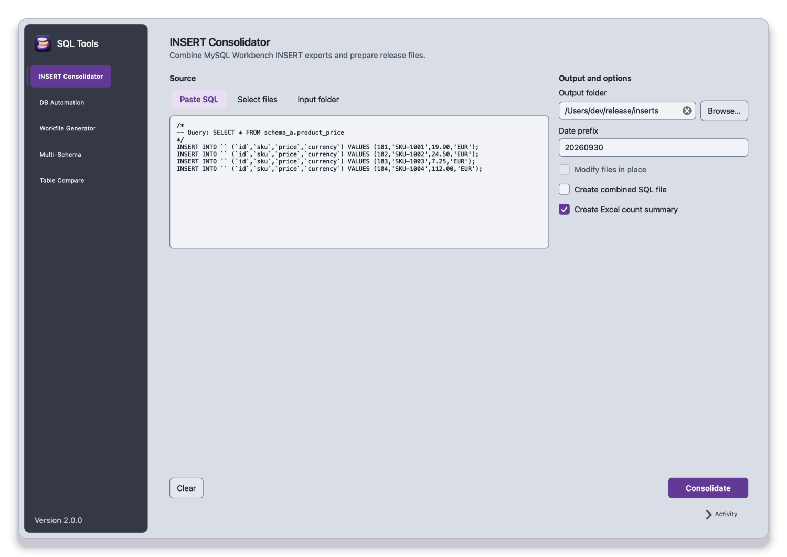
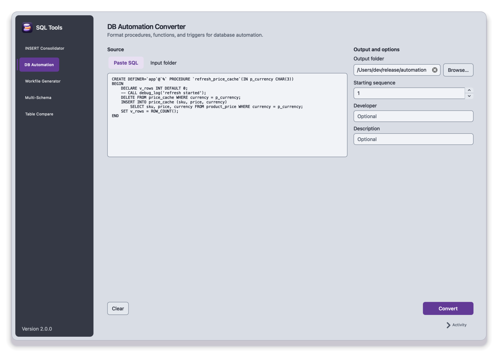
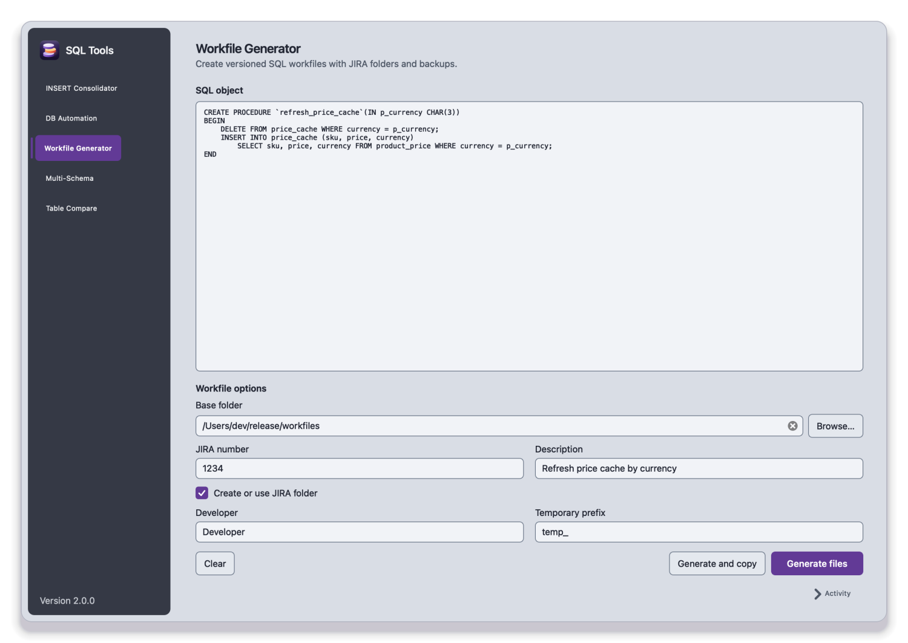
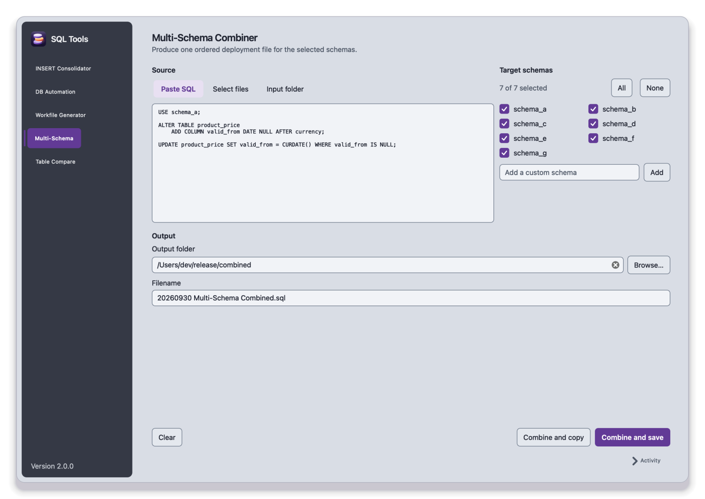

<div align="center">



# SQL Tools

**Release-file tooling for MySQL teams.**<br>
Consolidate exports, convert routines, version workfiles, fan scripts out to every schema, and compare tables, all offline, on your desktop.

[](https://github.com/k2ocabhinav/sql-tools-gui/actions/workflows/build.yml)


[Tools](#the-five-tools) · [Get started](#get-started) · [Configure](#make-it-yours) · [Build](#build-a-release) · [Develop](#development)

<br>



</div>

<br>

## Why it exists

Shipping database changes usually means a long tail of small, error-prone chores: merging dozens of Workbench `INSERT` exports, adding headers to stored routines, naming and versioning files, repeating one script across several schemas, and eyeballing two exports in a spreadsheet to see what drifted between environments.

SQL Tools turns those chores into five focused tools with one consistent interface. It works on files you already have, so there is nothing to connect and nothing to configure before you are useful.

- **Safe by default.** Outputs are prepared in a staging folder, collisions are listed together, and nothing is replaced until you confirm. Cancelling or failing leaves existing files untouched.
- **Offline.** No database connections, no accounts, no network access, no telemetry.
- **Native and quiet.** Qt Widgets with system fonts and controls, keyboard-friendly, honours your OS text size, and can turn off its few transitions (**View → Reduce motion**).
- **Fast on large exports.** Comparison runs in the background and stores rows compactly, so the window stays responsive.

## The five tools

| Tool | What it does |
| --- | --- |
| **INSERT Consolidator** | Merges Workbench `INSERT` exports into one statement per table. Optionally writes a combined file with `TRUNCATE` + inserts and an Excel row-count summary. |
| **DB Automation Converter** | Prepares procedures, functions and triggers for automated deployment: adds the header, comments out debug calls, and wraps the routine in `DELIMITER` statements. |
| **Workfile Generator** | Turns raw routine or view code into numbered, dated workfiles with a header and a backup, optionally inside a ticket folder that continues its version sequence. |
| **Multi-Schema Combiner** | Repeats a script for every selected schema, rewriting the `USE` statement, and saves one ordered deployment file or copies it to the clipboard. |
| **Table Compare** | Compares the same table across two or more environments from CSV or SQL exports, keyed on the column you choose, then exports the result to Excel. |

Every tool that takes SQL accepts pasted text, individual files, or a whole folder.

## A look around

<table>
<tr>
<td width="50%" valign="top">
<b>Table Compare</b><br>
Load exports, pick a key and the columns that matter, and see exactly what changed, what exists on one side only, and what matches.<br><br>

</td>
<td width="50%" valign="top">
<b>INSERT Consolidator</b><br>
Paste, pick files, or point at a folder. Choose where the results go and which extras to produce.<br><br>

</td>
</tr>
<tr>
<td width="50%" valign="top">
<b>DB Automation Converter</b><br>
Routine in, deployment-ready file out, with the header, sequence number and delimiters handled for you.<br><br>

</td>
<td width="50%" valign="top">
<b>Workfile Generator</b><br>
Consistent names, ticket folders and backups without hand-editing paths.<br><br>

</td>
</tr>
<tr>
<td width="50%" valign="top">
<b>Multi-Schema Combiner</b><br>
Tick the target schemas, add a custom one if you need it, and produce a single ordered script.<br><br>

</td>
<td width="50%" valign="top">
<b>Built to stay out of the way</b>
<ul>
<li>One background job at a time, with progress and a cancel button</li>
<li>An <b>Activity</b> drawer for summaries and warnings</li>
<li>Inline validation that clears when you fix the problem</li>
<li>Your typing and selections survive switching modes and resizing</li>
</ul>
</td>
</tr>
</table>

## Get started

You need [uv](https://docs.astral.sh/uv/), which installs the right Python for you (3.13).

**macOS**

```sh
brew install uv
git clone https://github.com/k2ocabhinav/sql-tools-gui.git
cd sql-tools-gui
uv sync --locked
uv run --locked python -m sqltools
```

**Windows (PowerShell)**

```powershell
winget install --id=astral-sh.uv -e
git clone https://github.com/k2ocabhinav/sql-tools-gui.git
cd sql-tools-gui
uv sync --locked
uv run --locked python -m sqltools
```

After the first sync you can also double-click `SQL Tools.command` (macOS) or `SQL Tools.bat` (Windows). Prefer an installer? [Build one](#build-a-release) for your platform in a single command.

<details>
<summary><b>Working inside OneDrive, iCloud or Dropbox?</b></summary>

<br>

Keep the Python environment outside the synced folder. OneDrive rejects file names that Python packages contain (for example `.lock`) and reports sync errors. The launcher scripts and `build.bat` already do this by setting `UV_PROJECT_ENVIRONMENT`. For your own terminal, set it once:

```sh
export UV_PROJECT_ENVIRONMENT="$HOME/.venvs/sql-tools"
```

On Windows: `setx UV_PROJECT_ENVIRONMENT "%LOCALAPPDATA%\SQLTools\venv"`.

</details>

## Make it yours

The defaults for schemas, developer name and temporary-table prefix are generic (`schema_a`, `Developer`, `temp_`). To use your own, copy the example file and edit it. The copy is git-ignored, so your environment details stay on your machine.

```sh
cp .sqltools-private.example.json .sqltools-private.json
```

```json
{
  "default_schemas": ["schema_a", "schema_b", "schema_c"],
  "schema_prefix": "schema_",
  "developer_name": "Your Name",
  "temp_prefix": "temp_"
}
```

Set `SQL_TOOLS_PRIVATE_CONFIG` to point at a file elsewhere. A normal build embeds these values; `--public` builds always use the generic defaults.

## Build a release

Build on the platform you are targeting; PyInstaller does not cross-compile.

```sh
uv sync --locked --extra dev
uv run --locked --extra dev python build.py
```

| Platform | Output |
| --- | --- |
| **macOS** | `SQL Tools.app` and a compressed `.dmg` (about 57 MB and 15 MB) |
| **Windows x64** | A portable ZIP, plus a per-user installer when [Inno Setup](https://jrsoftware.org/isinfo.php) is installed |

Artifacts are written to a temporary folder outside your checkout by default (pass `--output-root PATH` to choose one), and the build ends with a smoke test of the packaged app that runs each tool's real workflow.

<details>
<summary><b>Options, size, signing and distribution notes</b></summary>

<br>

- **Feature subsets:** `--features DB_AUTOMATION,TABLE_COMPARE` builds only the tools you list.
- **Sharing a build:** add `--public` so no local defaults are embedded.
- **Size:** the bundle leaves out Qt parts and Python modules the app never uses (networking and TLS, image-format plugins, translations, legacy codecs). The build's smoke test exercises Excel export and every tool's workflow so trimming cannot silently break a feature.
- **Signing:** set `SQL_TOOLS_CODESIGN_IDENTITY` (macOS) or `SQL_TOOLS_SIGN_THUMBPRINT` (Windows, with the Windows SDK `signtool`). Set `SQL_TOOLS_NOTARY_PROFILE` to notarize and staple the macOS disk image. Keep credentials in your secret store, never in the repository.
- **Unsigned builds** can trigger Gatekeeper or SmartScreen. On managed devices, use an organisation-approved signed release and ask IT to approve the publisher rather than bypassing the control.
- **Installing:** open the `.dmg` and drag the app to Applications, or run the Windows installer / extract the portable ZIP.

</details>

## Development

```sh
uv sync --locked --extra dev
uv run --locked --extra dev pytest
uv run --locked --extra dev ruff check .
uv run --locked --extra dev python -m sqltools --smoke-test
```

Plain `uv sync` makes the environment match exactly what you request, so it removes the dev tools; keep `--extra dev` while developing. GitHub Actions runs the same checks and builds on Windows x64, Apple Silicon and Intel macOS for every push.

```text
sqltools/        the Qt application: startup, navigation, pages and shared widgets
  ui/              one module per tool plus the reusable widgets
  jobs.py          one cancellable background worker at a time
  services.py      adapts page requests to the logic modules and stages outputs
  theme.py         colours, type and control styling
logic/           SQL and comparison behaviour, independent of the UI and unit-tested
assets/          app icon (icon.svg is the master), plus generated png / ico / icns
packaging/       Windows installer script and the icon generator
tests/           transformations, comparison, staged-output safety, layout and build checks
```

Workers never touch Qt widgets or models. The compact comparison path stores rows as tuples and results as source-row offsets, so large exports do not multiply memory. To change the icon, edit `assets/icon.svg` and run `uv run --extra dev python packaging/make_icons.py`.

## Scope

SQL Tools works on files you supply. It does not connect to databases, store credentials, or export comparison results to anything other than Excel. Any future direct-connection feature would need secure credential handling, TLS, timeouts, read-only query boundaries and bounded fetches before it ships.

Day-to-day development happens on macOS. Windows x64 shares the same Qt code and is built by CI, but has had less hands-on testing, so reports from Windows users are especially welcome.

## Contributing

Issues and ideas are welcome. Please include a small synthetic example (never real data) when you report a parsing problem. If you would like to contribute code, open an issue first so we can agree on the approach; run the tests and `ruff` before you send anything. See [CHANGELOG.md](CHANGELOG.md) for what changed and when.

## License

No open-source license has been chosen yet, so all rights are reserved. If you would like to use SQL Tools beyond trying it out, please open an issue to talk about it.

Built with [Qt for Python (PySide6)](https://doc.qt.io/qtforpython-6/) and [openpyxl](https://openpyxl.readthedocs.io/).
